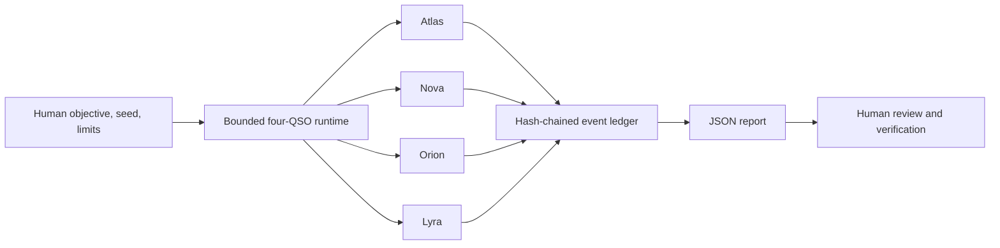

# QSO-FABRIC

QSO-FABRIC is the bounded, deterministic integration harness for four Quantum State Objects: Atlas, Nova, Orion, and Lyra. A researcher supplies one objective, seed, and explicit limits; the runtime produces per-QSO observations and proposals, bounded message exchange, state freeze hashes, and an append-only hash-chained event ledger.

> **Release status:** blocked pending acceptance of the current runtime baseline, packaging and licensing, versioned output contracts, adversarial and rollback fixtures, security evidence, provenance, and read-only upstream compatibility. See [`release.md`](release.md) for the authoritative gates.

## Documentation

- [GitHub Pages project overview](docs/index.html)
- [Architecture and trust boundaries](docs/ARCHITECTURE.md)
- [Developer onboarding](docs/DEVELOPER_GUIDE.md)
- [Current output behavior and contract requirements](docs/OUTPUT_CONTRACTS.md)
- [Active task chain](taskchain.md)
- [Release plan](release.md)
- [Changelog](changelog.md)

## Purpose

The current product objective is to stabilize the implemented four-QSO experiment as a reproducible integration harness. Formal verification of the existing runtime comes before additional learning, visualization, payment behavior, production orchestration, or portfolio administration.

The four roles are:

| QSO | Focus |
|---|---|
| Atlas | Mathematical structure, algorithms, compression, and cross-domain mapping |
| Nova | Verification, anomaly detection, testing, security, and contradiction analysis |
| Orion | Software architecture, interfaces, protocols, and systems composition |
| Lyra | Language, documentation, ontology, epistemology, and human context |

## Architecture at a glance



The generated report is a research artifact. It records what the harness produced; it does not authorize execution or establish that a final proposal is correct.

## Run

The repository does not yet declare an accepted package definition or supported Python matrix. For local baseline work, use an isolated environment and record the exact interpreter and tool versions.

```bash
python3 -m venv .venv
. .venv/bin/activate
python -m pip install --upgrade pip pytest
python -m pytest -q
```

Run the experiment:

```bash
python -m qso_runtime.four_qso_experiment \
  "Evaluate the QSO payment-distribution architecture" \
  --seed 2987 \
  --rounds 4 \
  --output artifacts/four_qso_report.json
```

The runner writes a JSON report and prints its path, ledger-validity result, and event count. Inspect and checksum the complete artifact rather than relying only on the console summary.

```bash
python -m json.tool artifacts/four_qso_report.json >/dev/null
shasum -a 256 artifacts/four_qso_report.json
```

## Current evidence boundary

The existing tests cover seeded equality, ledger validity, expected QSO identities, freeze/message presence, final proposals, and Nova's verification posture. They do **not** yet satisfy the complete release suite, which must also address clean installation, cross-environment deterministic hashes, malformed and boundary inputs, timeout, tampering, interruption, partial writes, rollback, dependency and workflow security, and upstream contract drift.

Current JSON and hashing behavior is unversioned candidate behavior. Consumers should pin the producing commit and must not infer a stable schema until P1 adds accepted version and canonicalization rules.

## Safety boundary

- No shell, package-installation, credential, wallet, or unrestricted network authority is granted to QSOs.
- Messages, rounds, message length, and runtime are bounded.
- The experiment stops bounded iteration at configured limits and records its result.
- Outputs are proposals and research artifacts requiring human review.
- QSO-GENOMES and QuantumStateObjects may become read-only schema/hash-validated dependencies; they do not grant executable authority.
- Owner-wide repository mutation and portfolio-governance automation are outside QSO-FABRIC's current scope.

## Contribution discipline

Work only on the highest-priority unblocked item in [`taskchain.md`](taskchain.md). Preserve deterministic ordering, fail-closed validation, bounded authority, append-only evidence, and explicit rollback. Changes to events, report fields, freeze semantics, seeds, ordering, or canonicalization are contract changes and require versioning, fixtures, migration or rejection behavior, documentation, and retained hashes.

See the [developer guide](docs/DEVELOPER_GUIDE.md) for the complete baseline, security, pull-request, and rollback workflow.
