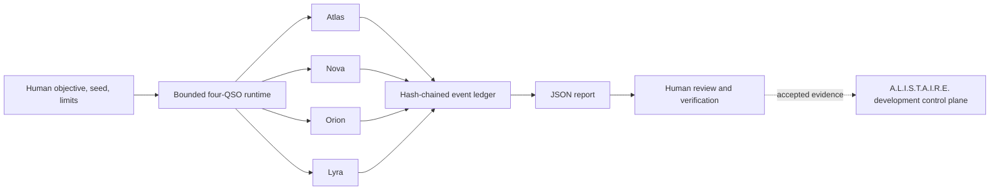

# QSO-FABRIC

QSO-FABRIC is the bounded, deterministic integration harness for four Quantum State Objects: Atlas, Nova, Orion, and Lyra. A researcher supplies one objective, seed, and explicit limits; the runtime produces per-QSO observations and proposals, bounded message exchange, state freeze hashes, and an append-only hash-chained event ledger.

Within the wider portfolio, **A.L.I.S.T.A.I.R.E. is the canonical system and QSO-FABRIC is one subsystem**: the collaboration, integration, and evidence layer. QSO-FABRIC is not the portfolio control plane, canonical QSO-format authority, credential broker, deployment authority, or unrestricted self-modification engine.

> **Release status:** blocked pending acceptance of the current runtime baseline, packaging and licensing, versioned output contracts, adversarial and rollback fixtures, security evidence, provenance, read-only upstream compatibility, and resolution of cross-repository format/lifecycle/authority ownership. See [`release.md`](release.md) for the authoritative gates.

## Documentation

- [GitHub Pages project overview](docs/index.html)
- [Role in A.L.I.S.T.A.I.R.E.](docs/ALISTAIRE_ROLE.md)
- [Architecture and trust boundaries](docs/ARCHITECTURE.md)
- [Concurrent candidate governance](docs/CANDIDATE_GOVERNANCE.md)
- [Obstruction and gluing analysis](docs/OBSTRUCTION_AND_GLUING.md)
- [Developer onboarding](docs/DEVELOPER_GUIDE.md)
- [Current output behavior and contract requirements](docs/OUTPUT_CONTRACTS.md)
- [Active task chain](taskchain.md)
- [Release punch list](punchlist.md)
- [Release plan](release.md)
- [Changelog](changelog.md)

## Purpose

The current product objective is to stabilize the implemented four-QSO experiment as a reproducible integration harness. Formal verification of the existing runtime comes before additional learning, visualization, payment behavior, production orchestration, portfolio administration, a portfolio-wide QSO serialization standard, or authoritative QSIO integration.

This narrow priority supports the long-term autonomous-development objective: A.L.I.S.T.A.I.R.E. needs a reproducible substrate that can distinguish candidate ideas from accepted contracts, detect integrity failures, retain provenance, and roll back safely. Autonomous portfolio planning, branch creation, pull-request preparation, merging, deployment, governance, capability issuance, and canonical-state decisions require separately chartered owners rather than an implicit expansion of this runtime.

The four roles are:

| QSO | Focus |
|---|---|
| Atlas | Mathematical structure, algorithms, compression, and cross-domain mapping |
| Nova | Verification, anomaly detection, testing, security, and contradiction-oriented review |
| Orion | Software architecture, interfaces, protocols, and systems composition |
| Lyra | Language, documentation, ontology, epistemology, and human context |

## Architecture at a glance



The generated report is a research artifact. It records what the harness produced; it does not authorize execution or establish that a final proposal is correct. The dotted control-plane edge is an architectural boundary, not an implemented integration.

## Candidate integration topology

Two newer draft candidates require explicit gluing decisions rather than implicit accumulation:

- **PR #16** proposes a disabled QSIO adapter mapping Fabric concepts to QSO, QSI, QSIO, Nexis, Telion, Memora, Lumen, Umbra, and Witness records.
- **PR #17** proposes a QSO envelope, composition root, registry, mutation classes, serialization families, validator, and example under `quantum-state-objects/`.

These candidates overlap responsibilities already proposed for QSO-GENOMES, QuantumStateObjects, and `qsio-kernel`. They remain candidates until the portfolio assigns canonical ownership for identity, serialization, lifecycle, mutation, integrity, authoritative ledgers, capabilities, signing, privacy, and recovery. See the [obstruction and gluing analysis](docs/OBSTRUCTION_AND_GLUING.md).

## Autonomous-development boundary

QSO-FABRIC may contribute bounded hypotheses, deterministic experiments away from the wall-clock timeout boundary, contract checks, Nova's contradiction-oriented review posture, and integrity-marked evidence. The baseline reserves a `contradictions` field but does not yet populate contradiction records. QSO-FABRIC does not currently own:

- repository discovery or portfolio prioritization;
- branch, commit, pull-request, merge, release, or deployment authority;
- credentials, secrets, wallets, signing keys, or external service identities;
- unrestricted network learning or package installation;
- changes to governance, consent, identity, or safety constraints;
- automatic acceptance of another repository's code, manifest, policy, schema, hash, signature, Witness record, or QSIO record;
- portfolio-wide QSO format, lifecycle, capability, or canonical-state authority.

The previously scheduled cross-repository Muse bootstrap workflow is removed from this candidate. See [QSO-FABRIC in A.L.I.S.T.A.I.R.E.](docs/ALISTAIRE_ROLE.md) for the capability ladder and [candidate governance](docs/CANDIDATE_GOVERNANCE.md) for rules governing concurrent architecture proposals.

## Run

The repository does not yet declare an accepted package definition or supported Python matrix. For local baseline work, use an isolated environment and record the exact interpreter and tool versions.

```bash
python3 -m venv .venv
. .venv/bin/activate
python -m pip install --upgrade pip pytest
python -m pytest -q
```

Run the experiment:

```bash
python -m qso_runtime.four_qso_experiment \
  "Evaluate the QSO payment-distribution architecture" \
  --seed 2987 \
  --rounds 4 \
  --output artifacts/four_qso_report.json
```

The runner writes a JSON report and prints its path, ledger-validity result, and event count. Inspect and checksum the complete artifact rather than relying only on the console summary.

```bash
python -m json.tool artifacts/four_qso_report.json >/dev/null
shasum -a 256 artifacts/four_qso_report.json
```

## Current evidence boundary

The existing tests cover seeded equality, ledger validity, expected QSO identities, freeze/message presence, final proposals, and Nova's verification posture. They do **not** yet satisfy the complete release suite, which must also address clean installation, cross-environment deterministic hashes, malformed and boundary inputs, timeout, tampering, interruption, partial writes, rollback, dependency and workflow security, upstream contract drift, envelope canonicalization, lifecycle compatibility, capability separation, and recovery gluing.

Current JSON and hashing behavior is unversioned candidate behavior. Consumers should pin the producing commit and must not infer a stable schema until P1 adds accepted version and canonicalization rules. The QSO format and QSIO candidates do not change that status.

## Safety boundary

- No shell, package-installation, credential, wallet, signing-key, or unrestricted network authority is granted to QSOs.
- Round count, per-QSO message count, and per-message text are bounded by configured limits.
- The full objective remains present in the top-level report and first event, so the current implementation does not provide a complete report-size, privacy, or memory bound.
- Wall-clock timeout placement depends on `time.monotonic()` and scheduling; timeout-path event counts and hashes are not guaranteed deterministic.
- Outputs are proposals and research artifacts requiring human review.
- QSO-GENOMES and QuantumStateObjects may become read-only schema/hash-validated dependencies; they do not grant executable authority.
- A valid envelope, content hash, signature, Witness record, or accepted routing record proves neither policy acceptance nor permission to act.
- Owner-wide repository mutation and portfolio-governance automation are outside QSO-FABRIC's current scope.
- Open pull requests are candidates, not accepted architecture; concurrent candidates require explicit sequencing and exact-head evidence.

## Contribution discipline

Work only on the highest-priority unblocked item in [`taskchain.md`](taskchain.md) and use [`punchlist.md`](punchlist.md) to record evidence needs. Preserve deterministic ordering, fail-closed validation, bounded authority, append-only evidence, explicit consent constraints, and rollback. Changes to identities, events, reports, freeze semantics, mutation classes, seeds, ordering, canonicalization, serialization, integrity, authority, or external contracts require ownership, versioning, fixtures, migration or rejection behavior, documentation, and retained hashes.

See the [developer guide](docs/DEVELOPER_GUIDE.md) for the complete baseline, security, pull-request, and rollback workflow.
