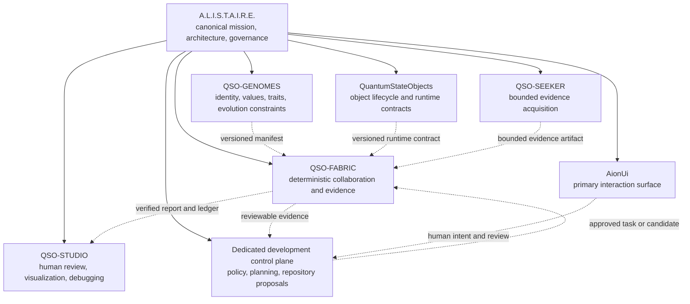
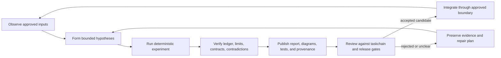

# QSO-FABRIC in A.L.I.S.T.A.I.R.E.

## Architectural doctrine

A.L.I.S.T.A.I.R.E. is the canonical system. QSO-FABRIC is one bounded subsystem within that system: the deterministic collaboration, evidence, and integration harness for Quantum State Objects. It is not the portfolio control plane, product identity authority, deployment owner, credential broker, or unrestricted self-modification engine.

This distinction allows the wider system to pursue increasingly capable autonomous development without silently expanding the authority of the first executable integration artifact.

> **Current maturity:** candidate runtime and documentation. Nothing in this document marks P0 complete, approves a release, activates network or repository authority, or accepts any open pull-request candidate.

## Portfolio position

The dotted edges are proposed contract relationships. They do not imply that the referenced contracts are accepted, executable, or available on the current release path.

## Mission contribution

QSO-FABRIC advances A.L.I.S.T.A.I.R.E. by making multi-QSO work:

1. **bounded** — finite rounds, messages, message length, and runtime;
2. **deterministic** — explicit seed and stable role order;
3. **inspectable** — structured per-QSO results and ordered events;
4. **integrity-marked** — hash-chained events and freeze-point hashes;
5. **reviewable** — proposals remain artifacts rather than implicit authority;
6. **contract-ready** — future dependencies must enter through version, schema, and hash validation.

The present implementation uses deterministic templates. It is an integration harness for testing structure and contracts, not evidence of open-ended cognition, sentience, physical quantum execution, or autonomous learning.

## Autonomous-development ladder

The long-term system objective is continuous autonomous development. Authority must be introduced as explicit, testable levels rather than as one undifferentiated capability.

| Level | Capability | QSO-FABRIC status |
|---|---|---|
| A0 | Observe repository state and consume approved, immutable inputs | Planned through read-only contract adapters |
| A1 | Generate hypotheses, designs, tests, documentation, and candidate artifacts | Partially represented by bounded proposals; not release-accepted |
| A2 | Execute deterministic experiments in an isolated sandbox | Candidate runtime exists; acceptance evidence incomplete |
| A3 | Prepare reviewable commits or pull requests through a dedicated control plane | Outside this repository's current scope |
| A4 | Merge, deploy, or operate within pre-approved policy and release gates | Not approved |
| A5 | Change governance, authority, credentials, or its own safety constraints | Explicitly not granted; requires separate architecture and approval |

Progression between levels requires declared identities, allowed actions, contract versions, provenance, tests, least-privilege credentials, audit evidence, rollback, and an approved owner. Passing a lower level does not imply permission for a higher one.

## Continuous improvement loop

QSO-FABRIC owns the bounded experiment, integrity evidence, and report portions of this loop. Repository selection, portfolio prioritization, credentialed writes, merge policy, deployment, and cross-repository rollback belong to a separately chartered control plane.

## Invariants

The following rules remain true even as A.L.I.S.T.A.I.R.E. becomes more autonomous:

- no capability is inferred from a proposal, role name, branch, scaffold, or documentation claim;
- every external dependency is identified, versioned, hashed, validated, and rejectable;
- every consequential action has a named policy owner, bounded scope, audit record, and rollback path;
- generated artifacts preserve the distinction between observation, inference, contradiction, proposal, decision, and execution;
- repository-specific `taskchain.md`, `release.md`, and `changelog.md` remain authoritative for local scope and maturity;
- QSO-FABRIC does not become the portfolio control plane merely because it coordinates QSOs;
- human review remains required wherever the active repository policy or release plan requires it.

## Required clarification before broader integration

The portfolio needs one explicit architecture decision outside QSO-FABRIC: identify the repository that owns autonomous development orchestration, including repository discovery, planning, branch creation, pull-request preparation, approval policy, merge/deployment authority, credentials, audit, and portfolio rollback. Until that owner and its contracts are approved, QSO-FABRIC may emit evidence and proposals but must not assume cross-repository authority.

## Related documents

- [Architecture](ARCHITECTURE.md)
- [Candidate governance](CANDIDATE_GOVERNANCE.md)
- [Developer guide](DEVELOPER_GUIDE.md)
- [Output contract notes](OUTPUT_CONTRACTS.md)
- [Task chain](../taskchain.md)
- [Release plan](../release.md)
