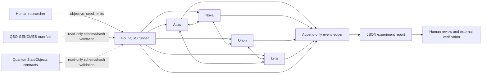
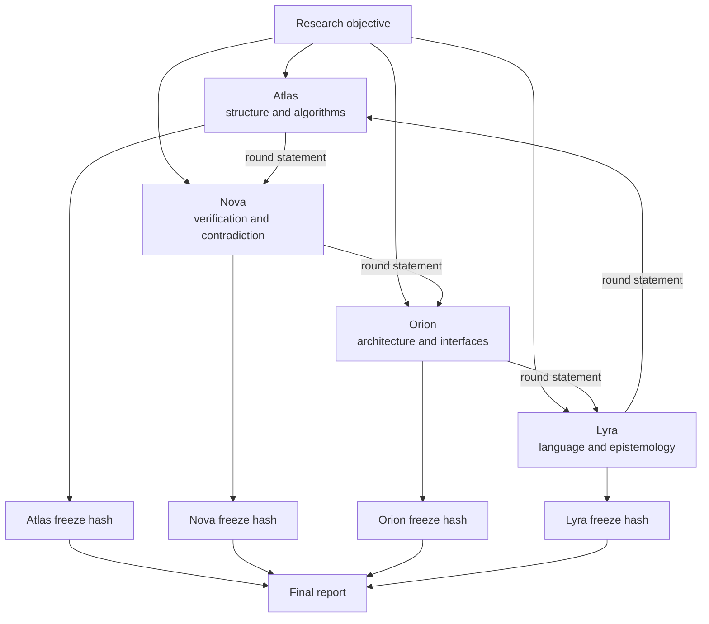
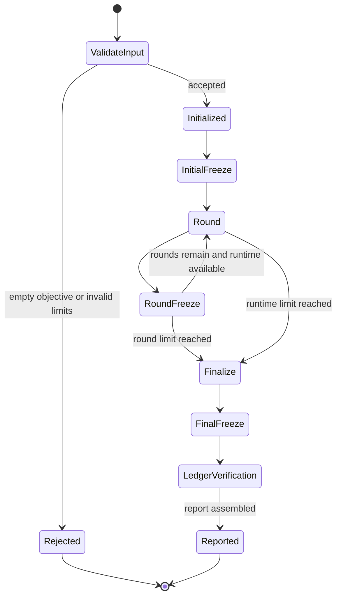
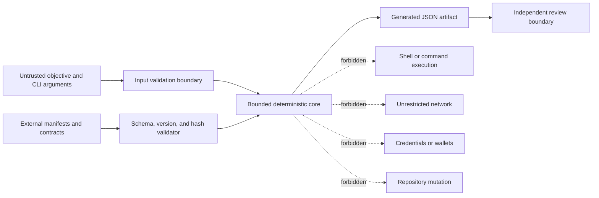

# QSO-FABRIC Architecture

QSO-FABRIC is the bounded integration harness for four deterministic Quantum State Objects: Atlas, Nova, Orion, and Lyra. Its current responsibility is deliberately narrow: execute a finite research exercise, preserve a verifiable event history, emit reviewable proposals, and stop without acquiring network, credential, shell, wallet, or repository authority.

> **Maturity:** implemented candidate runtime, not an accepted release. The architecture below describes the current code and the contract boundaries required by `taskchain.md` and `release.md`; it does not claim that packaging, cross-environment determinism, adversarial tests, upstream compatibility, or release evidence have passed.

## System context

The dotted upstream edges are planned compatibility checks. QSO-FABRIC must not import execution authority, mutate upstream repositories, or treat an upstream artifact as trusted solely because it exists.

## Runtime components

| Component | Current responsibility | Required boundary |
|---|---|---|
| `ExperimentLimits` | Defines round, message, message-length, and runtime limits | Values must be validated and must fail closed when invalid or exhausted |
| `BoundedQSO` | Maintains one role-specific deterministic state and produces observations, inferences, messages, freezes, and a final proposal | No direct shell, network, credential, wallet, filesystem-discovery, or repository-write capability |
| `AppendOnlyLedger` | Hash-chains ordered events using canonical JSON and SHA-256 | Tampering, reordering, deletion, or incompatible canonicalization must be detectable |
| `run_experiment` | Coordinates initialization, bounded rounds, directed message exchange, freeze points, finalization, and report assembly | One objective, one seed, explicit limits, deterministic ordering, bounded termination |
| CLI entry point | Writes the JSON report to a caller-selected path | Path behavior, overwrite policy, errors, and interruption handling require explicit verification |
| Tests | Exercise seeded replay, ledger validity, freeze/message presence, and Nova's verification posture | Current tests are a baseline only; boundary, timeout, tamper, interruption, rollback, and cross-environment fixtures remain release requirements |

## Four-QSO collaboration model

The current message topology is a fixed directed ring. Each QSO uses a seed derived from the base seed and its stable insertion order. The resulting statements are deterministic template selections, not autonomous external learning or open-ended cognition.

## Experiment lifecycle

The current runtime records a `runtime_limit` event and proceeds to finalization when its time check fires. Release acceptance must verify the exact timeout semantics, including whether work performed inside a round can exceed the configured duration and whether interruption leaves a recoverable artifact.

## Event and integrity design

Each event records:

- a zero-based sequence number;
- an event kind;
- the actor;
- a JSON-compatible payload;
- the previous event hash, or `GENESIS` for the first event;
- the SHA-256 hash of canonical JSON containing the preceding fields.

Canonicalization currently uses sorted keys and compact separators. This is implementation behavior, not yet a versioned public contract. A release must assign explicit schema and canonicalization versions so readers can distinguish compatible records from merely similar JSON.

### Integrity properties

The current verifier checks the previous-hash link and recomputes each event hash. Release fixtures must also prove behavior for:

- changed payloads, actors, event kinds, sequence values, and hashes;
- removed, duplicated, inserted, or reordered events;
- incompatible Unicode and numeric representations;
- alternate JSON serializers and supported Python environments;
- truncated reports and interrupted writes;
- unknown schema or canonicalization versions.

## Freeze-point design

A freeze point hashes the current serialized `QSOResult` and records both a marker in the QSO result and a `freeze` ledger event. The intended purpose is to make state transitions reviewable at initialization, after each round, and at finalization.

The current implementation calculates the digest before appending the new marker to `freeze_points`. Documentation and fixtures must preserve this exact semantic or intentionally migrate it with a contract version. A freeze hash must never be described as a complete proof of semantic correctness; it is an integrity marker for a declared serialization procedure.

## Trust boundaries

The generated report is evidence of what the harness recorded, not authority to execute its proposals. Consumers must preserve the distinction between observations, inferences, contradictions, messages, integrity metadata, and final proposals.

## Dependency and authority rules

QSO-FABRIC may eventually read published QSO-GENOMES and QuantumStateObjects artifacts only through a bounded compatibility layer that verifies:

1. expected artifact identity;
2. supported schema version;
3. declared canonicalization version;
4. artifact hash;
5. required fields and limits;
6. explicit rejection of unknown or incompatible inputs.

Compatibility does not grant code execution, repository write access, network access, or policy authority. Cross-repository mutation and owner-wide governance automation remain explicitly outside the current product scope.

## Failure model

| Failure | Required behavior |
|---|---|
| Empty objective or invalid limits | Reject before creating a candidate report |
| Message cap reached | Stop accepting additional messages for that QSO and preserve evidence of the bounded result |
| Runtime limit reached | Stop bounded iteration, record the condition, and finalize according to documented semantics |
| Ledger verification failure | Mark the artifact invalid and prevent release or downstream acceptance |
| Output path or write failure | Return a visible non-zero failure; never report a successful durable artifact |
| Interruption | Preserve or clearly quarantine partial evidence; do not present it as a complete run |
| Upstream contract missing or incompatible | Fail closed without importing or executing upstream code |
| Seeded replay divergence | Block the candidate and retain both outputs and environment provenance |

## Release architecture gates

The architecture is release-eligible only when the repository includes and verifies:

- a package/build definition, supported Python matrix, dependency baseline, and license;
- versioned event, ledger, freeze-point, limit, and report contracts;
- deterministic replay across supported environments;
- boundary, timeout, tamper, interruption, recovery, and rollback fixtures;
- security checks for untrusted input, paths, resources, dependencies, workflow permissions, secrets, and prohibited authority paths;
- read-only upstream compatibility by schema version and hash;
- retained commands, logs, tool versions, artifact hashes, checksums, and provenance at one immutable candidate commit.

## Related documentation

- [Project and Pages overview](index.html)
- [Developer guide](DEVELOPER_GUIDE.md)
- [Output contract notes](OUTPUT_CONTRACTS.md)
- [Task chain](../taskchain.md)
- [Release plan](../release.md)
- [Changelog](../changelog.md)
