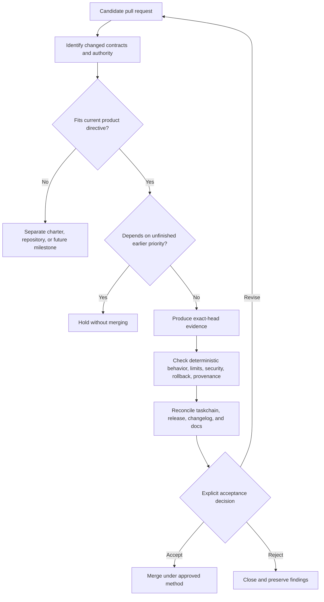

# QSO-FABRIC Candidate Governance

QSO-FABRIC currently has multiple open pull requests that explore different future directions. This document prevents a branch, scaffold, adapter, or design proposal from being mistaken for accepted architecture.

> **Authority rule:** `main`, `taskchain.md`, and `release.md` define the accepted repository state. An open pull request is a candidate only. Mergeability, test success, documentation completeness, or architectural ambition does not independently grant product scope or runtime authority.

## Candidate classes

| Class | Examples | Required treatment |
|---|---|---|
| Baseline verification | Packaging, contract versioning, deterministic fixtures, rollback evidence | Evaluate against P0–P3 in order; may advance the current release path |
| Documentation | Pages, architecture, onboarding, contract notes | May clarify current behavior and gates; must not present candidate behavior as accepted |
| Integration adapter | QSIO or other cross-repository contract adapters | Keep disabled, dependency-light, read-only where possible, and blocked behind explicit contract acceptance |
| Expanded runtime | Experimenters, Seeker sprites, gromerical augmentation, self-learning orchestration | Treat as separately reviewable capability candidates; do not merge by accumulation into the baseline |
| Governance/control plane | Repository discovery, planning, branch/PR creation, merge/deploy automation | Requires a dedicated owner and independent release/security model; not a QSO-FABRIC runtime responsibility |
| Safety repair | Consent, authority, integrity, provenance, or rollback enforcement | Compare against current policy and exact-head evidence; repair work does not automatically validate unrelated candidates |

## Admission sequence

## Required candidate record

Every candidate that changes behavior, contracts, authority, dependencies, or release scope should state:

- objective and user outcome;
- included and excluded scope;
- base and exact head commit;
- changed runtime and data contracts;
- new permissions, credentials, network paths, filesystem paths, or repository actions;
- feature flag or inert-by-default behavior;
- tests and retained evidence produced at the exact head;
- failure, timeout, interruption, and rollback behavior;
- migration or rejection behavior for older artifacts;
- effect on `taskchain.md`, `release.md`, `changelog.md`, and public documentation;
- explicit acceptance owner and unresolved decisions.

## Conflict rules

Concurrent candidates must not be combined solely because each is individually mergeable. Rebase and integration review are required when candidates touch any shared invariant, including:

- QSO identity or role semantics;
- event ordering, kinds, payloads, or canonicalization;
- freeze-point construction;
- message topology or limit behavior;
- consent or authority policy;
- external dependency identity, schema, or hashes;
- network, shell, credential, wallet, filesystem, repository, or deployment capabilities;
- packaging, supported Python versions, entry points, or artifact layout;
- task priority, release gates, or maturity claims.

A later candidate must not silently inherit the assumptions of an earlier unmerged branch. Each integration result requires its own exact-head evidence.

## Current architectural tension

The repository's accepted directive is a narrow bounded four-QSO verification harness. Open candidates also explore expanded collectives, evidence acquisition, self-learning scaffolds, sovereign sprite policy, and QSIO integration. These may support the wider A.L.I.S.T.A.I.R.E. mission, but they represent distinct capability increments and cannot all be treated as one implicit next version.

The required sequencing decision is:

1. finish and accept the bounded baseline;
2. accept versioned upstream and adapter contracts;
3. choose one bounded capability increment;
4. verify it independently;
5. only then compose additional increments.

This ordering does not reject long-term autonomous development. It creates the reproducible substrate needed for autonomous development to accelerate without losing provenance, rollback, or architectural comprehension.

## Documentation status language

Use these terms consistently:

- **implemented candidate** — code exists on a branch or `main`, but release acceptance is incomplete;
- **documented candidate semantics** — documentation describes observed behavior without promising stability;
- **verified candidate** — exact-head evidence passes declared checks, but acceptance may still be pending;
- **accepted architecture** — recorded in authoritative planning and release documents and merged through the approved process;
- **released capability** — all release gates and approval requirements passed for an immutable version.

Avoid using *complete*, *operational*, *autonomous*, *production-ready*, *secure*, or *released* without the evidence and approval required by `release.md`.

## Related documents

- [A.L.I.S.T.A.I.R.E. role](ALISTAIRE_ROLE.md)
- [Architecture](ARCHITECTURE.md)
- [Developer guide](DEVELOPER_GUIDE.md)
- [Task chain](../taskchain.md)
- [Release plan](../release.md)
