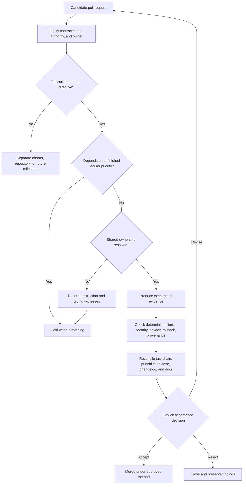

# QSO-FABRIC Candidate Governance

QSO-FABRIC currently has multiple open pull requests that explore different future directions. This document prevents a branch, scaffold, adapter, serialization standard, or design proposal from being mistaken for accepted architecture.

> **Authority rule:** `main`, `taskchain.md`, and `release.md` define the accepted repository state. An open pull request is a candidate only. Mergeability, test success, documentation completeness, a version label, cryptographic integrity, or architectural ambition does not independently grant product scope or runtime authority.

## Candidate classes

| Class | Examples | Required treatment |
|---|---|---|
| Baseline verification | Packaging, contract versioning, deterministic fixtures, rollback evidence | Evaluate against P0–P3 in order; may advance the current release path |
| Documentation | Pages, architecture, onboarding, contract notes, obstruction ledgers | May clarify current behavior and gates; must not present candidate behavior as accepted |
| Integration adapter | QSIO or other cross-repository adapters | Keep disabled, dependency-light, read-only where possible, and blocked behind explicit contract and capability acceptance |
| Format and contract proposal | QSO envelopes, registries, serialization, composition roots, mutation classes | Requires a canonical owner, field vocabulary, conformance vectors, migration plan, and cross-repository authority review before normative use |
| Expanded runtime | Experimenters, Seeker sprites, gromerical augmentation, self-learning orchestration | Treat as separately reviewable capability candidates; do not merge by accumulation into the baseline |
| Governance/control plane | Repository discovery, planning, branch/PR creation, merge/deploy automation | Requires a dedicated owner and independent release/security model; not a QSO-FABRIC runtime responsibility |
| Safety repair | Consent, authority, integrity, provenance, privacy, or rollback enforcement | Compare against current policy and exact-head evidence; repair work does not automatically validate unrelated candidates |

## Admission sequence

## Required candidate record

Every candidate that changes behavior, contracts, authority, dependencies, release scope, serialization, identity, or persistent evidence should state:

- objective and user outcome;
- included and excluded scope;
- base and exact head commit;
- changed runtime, data, serialization, lifecycle, and evidence contracts;
- canonical owner for every shared field and transition;
- new permissions, credentials, signing keys, network paths, filesystem paths, or repository actions;
- data classification, privacy, retention, correction, and deletion effects;
- feature flag or inert-by-default behavior;
- tests and retained evidence produced at the exact head;
- failure, timeout, interruption, revocation, freeze, and rollback behavior;
- migration or rejection behavior for older artifacts;
- effect on `taskchain.md`, `punchlist.md`, `release.md`, `changelog.md`, and public documentation;
- explicit acceptance owner and unresolved decisions.

## Conflict rules

Concurrent candidates must not be combined solely because each is individually mergeable. Rebase and integration review are required when candidates touch any shared invariant, including:

- QSO identity, family, role, genome, or runtime semantics;
- schema IDs, versions, canonicalization, content hashes, signatures, mutation classes, or composition roots;
- event ordering, kinds, payloads, ledger classes, or canonical-state promotion;
- freeze, Quietus, revocation, replay, recovery, or rollback;
- message topology or limit behavior;
- consent, capability, or authority policy;
- external dependency identity, schemas, or hashes;
- network, shell, credential, wallet, signing, filesystem, repository, or deployment capabilities;
- packaging, supported Python versions, entry points, or artifact layout;
- privacy, retention, correction, or evidence publication;
- task priority, release gates, or maturity claims.

A later candidate must not silently inherit the assumptions or evidence of an earlier unmerged branch. Each integration result requires its own exact-head evidence.

## Current architectural tension

The repository's accepted directive is a narrow bounded four-QSO verification harness. Open candidates also explore expanded collectives, evidence acquisition, self-learning scaffolds, sovereign sprite policy, QSIO integration, and a QSO file-format family.

PR #16 maps Fabric concepts to QSO/QSI/QSIO, Nexis, Telion, Memora, Lumen, Umbra, and Witness records. PR #17 proposes a QSO envelope, composition root, registry, serialization modes, hashes, signatures, and mutation classes under `quantum-state-objects/`. These candidates overlap responsibilities proposed for QSO-GENOMES, QuantumStateObjects, `qsio-kernel`, and Repository `1`.

The required sequencing decision is:

1. finish and accept the bounded baseline;
2. assign canonical owners for identity, format, lifecycle, ledger, capability, signing, privacy, and recovery;
3. accept versioned upstream and adapter contracts;
4. choose one bounded capability increment;
5. verify it independently with pairwise and triple-overlap witnesses;
6. only then compose additional increments.

This ordering does not reject long-term autonomous development or the format/adapter candidates. It creates the reproducible substrate needed for autonomous development to accelerate without losing provenance, rollback, or architectural comprehension.

## Gluing requirements

A candidate that crosses repository boundaries must identify its local section, gluing maps, and witnesses. Pairwise compatibility is not sufficient where three systems share identity, lifecycle, authority, or evidence.

Required triple-overlap witness groups currently include:

- genome → format → runtime;
- format → runtime → Fabric;
- Fabric → QSIO → Repository `1`;
- freeze → revocation → recovery;
- evidence → interface → correction.

See [`OBSTRUCTION_AND_GLUING.md`](OBSTRUCTION_AND_GLUING.md) for the active ledger and repair candidates.

## Authority interpretation

The following artifacts prove integrity or status only within their declared contract. They do not independently authorize execution, mutation, publication, merge, release, deployment, or canonical-state promotion:

- a valid QSO envelope;
- a content hash or signature;
- a passing schema validator;
- a Witness record;
- an immutable routing record;
- a valid local event ledger;
- a successful command or adapter call;
- a mergeable pull request;
- a passing branch-specific workflow.

Consequential authority requires a separate, valid, scoped, unexpired capability or explicit human approval from the designated owner.

## Documentation status language

Use these terms consistently:

- **implemented candidate** — code exists on a branch or `main`, but release acceptance is incomplete;
- **documented candidate semantics** — documentation describes observed behavior without promising stability;
- **verified candidate** — exact-head evidence passes declared checks, but acceptance may still be pending;
- **accepted architecture** — recorded in authoritative planning and release documents and merged through the approved process;
- **released capability** — all release gates and approval requirements passed for an immutable version.

Avoid using *canonical*, *normative*, *complete*, *operational*, *autonomous*, *production-ready*, *secure*, or *released* without the ownership, evidence, and approval required by `release.md`.

## Related documents

- [A.L.I.S.T.A.I.R.E. role](ALISTAIRE_ROLE.md)
- [Architecture](ARCHITECTURE.md)
- [Obstruction and gluing analysis](OBSTRUCTION_AND_GLUING.md)
- [Developer guide](DEVELOPER_GUIDE.md)
- [Task chain](../taskchain.md)
- [Punch list](../punchlist.md)
- [Release plan](../release.md)
