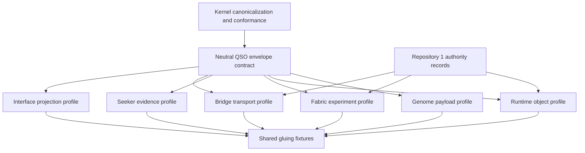

# QSO Format Governance and Ownership

## Status

**Decision guide only — no format, registry, mutation class, signature, capability, or canonical-state authority is accepted by this document.**

This guide reconciles the portfolio-neutral concepts proposed by QSO-FABRIC PR #17 with the existing responsibilities of QSO-GENOMES, QuantumStateObjects, `qsio-kernel`, Repository `1`, Bridge, QSO-SEEKER, QSO-STUDIO, and AionUi. It narrows the decision surface before any candidate is selected or moved.

## Material obstruction

PR #17 combines several layers under `quantum-state-objects/`:

- a common envelope and family naming convention;
- a format registry;
- canonical JSON and planned canonical CBOR;
- package and stream profiles;
- composition-root references;
- content hashes and planned signatures;
- mutation classes and lifecycle transition records;
- QSO-CORE payload semantics.

Those layers do not share one natural owner. Keeping them together inside QSO-FABRIC would make a bounded experiment harness appear to own portfolio-wide identity, serialization, lifecycle, mutation, signing, and authority semantics. Moving the directory unchanged to another repository would preserve the same coupling problem under a different name.

The obstruction is therefore not merely directory placement. It is the absence of a versioned **ownership decomposition**.

## Lowest-coupling decomposition

The recommended candidate architecture separates a small portfolio-neutral envelope from repository-owned payload and policy profiles.

The neutral layer should contain only fields and algorithms that every profile genuinely shares. Repository-specific fields remain in their owning repository rather than being promoted into the common envelope for convenience.

## Candidate ownership matrix

| Concern | Recommended canonical owner | QSO-FABRIC responsibility | Explicit non-authority |
|---|---|---|---|
| Family identifier and envelope version | A dedicated cross-repository contract package, or `qsio-kernel` only if explicitly chartered | Consume a pinned version | Fabric does not unilaterally define the portfolio family namespace |
| Canonical JSON/CBOR algorithm identifiers and byte rules | Neutral contract owner with kernel conformance fixtures | Verify or call a pinned implementation | A successful local hash is not an accepted portfolio digest by itself |
| Genome identity, traits, lineage, immutable policy, compatibility | QSO-GENOMES | Reference accepted genome objects read-only | Fabric cannot rewrite genome identity or immutable policy |
| Runtime object lifecycle, activation, freeze, termination, recovery | QuantumStateObjects | Observe and report runtime transitions under a Fabric profile | Fabric-local state names do not redefine runtime lifecycle |
| Kernel semantic primitives and conformance | `qsio-kernel` if accepted as the kernel; otherwise an approved successor | Use only accepted stable interfaces | Kernel conformance does not grant operational authority |
| Experiment objective, seed, limits, messages, proposals, local event ledger, freeze evidence | QSO-FABRIC | Own and version the Fabric experiment profile | A local ledger is not canonical portfolio state |
| Retrieval observation, source attribution, sanitization, hostile-input metadata | QSO-SEEKER | Accept only approved evidence profiles | Fabric does not silently promote retrieved data to trusted state |
| Transport framing, delivery receipt, idempotency, correction, revocation propagation | Bridge | Produce or consume a profile through approved adapters | Transport success does not imply acceptance or authorization |
| Capability, approval, revocation, checkpoint, canonical decision, recovery authority | Repository `1` or approved successor | Include references in proposals and receipts | Mutation classes, hashes, signatures, or execution success cannot self-authorize |
| Human review projection, annotations, accessibility, correction requests | QSO-STUDIO and AionUi | Export bounded review records | Interfaces cannot become canonical by display or user-interface state alone |
| Signing-key custody and signer identity | Separately approved security authority | Verify allowed signatures when implemented | QSO-FABRIC does not issue or custody portfolio signing keys |

This matrix is a recommendation for review. Every assignment remains blocked until accepted in the relevant canonical repository and contract manifest.

## Minimal common envelope candidate

A neutral envelope should be deliberately smaller than PR #17's current combined model. A candidate minimum is:

- `format_family`;
- `format_version`;
- `profile_id` and `profile_version`;
- `object_id`;
- `created_at` with an explicit clock and timezone rule;
- `payload_encoding`;
- `canonicalization_id`;
- `hash_algorithm` and `content_hash`;
- `critical_fields`;
- optional provenance and previous-object references whose semantics are versioned.

The following should **not** enter the common envelope until an owner and cross-profile meaning are accepted:

- mutation or self-modification authority;
- lifecycle state names;
- consent or constitutional-policy decisions;
- capability grants;
- signer authority or trust level;
- canonical-state acceptance;
- retention, deletion, or correction policy;
- domain-specific identity and lineage fields;
- Fabric event and freeze semantics.

## Mutation-class repair

PR #17 currently proposes `immutable`, `append-only`, `externally-mutable`, `self-proposable`, `self-modifiable`, `ephemeral`, `derived`, `constitutional`, and `mixed` mutation classes. These combine storage behavior, authorship, policy authority, lifetime, provenance, and governance in one field.

The lowest-coupling repair is to decompose them into independent dimensions:

1. **storage mode** — immutable, append-only, replaceable, ephemeral;
2. **proposal source** — human, QSO, adapter, migration, recovery process;
3. **required authority class** — none for local ephemeral state, human approval, capability reference, threshold approval, recovery authority;
4. **derivation mode** — primary, derived, reconstructed;
5. **retention and correction policy** — profile-owned and separately versioned.

A QSO may be allowed to propose a change without possessing authority to approve or execute it. The phrase `self-modifiable` must not appear in a shared contract unless its policy, capability, limits, revocation, evidence, and recovery semantics are defined and fail-closed.

## Serialization obstruction

PR #17 describes canonical CBOR as normative binary interchange while the current verified authoring path is canonical JSON and the CBOR implementation remains planned. This creates a release-label ambiguity: a `0.1` object could appear conformant while the stated normative encoding is unavailable.

Until CBOR canonicalization, byte-level vectors, round-trip behavior, duplicate-key handling, numeric constraints, extension handling, and multi-language conformance are independently verified:

- canonical JSON should be labeled the only implemented authoring/validation profile;
- canonical CBOR should remain `PROPOSED` rather than normative;
- package and stream profiles should remain unaccepted;
- no signature profile should depend on unspecified CBOR bytes;
- readers must reject unsupported canonicalization identifiers rather than guessing.

## Registry governance

A format registry becomes authoritative only when it defines:

- owner and approval process;
- immutable release identity and digest;
- uniqueness and namespace rules;
- status values such as proposed, accepted, deprecated, and retired;
- compatibility and migration rules;
- collision and dispute resolution;
- correction and revocation behavior;
- signer and key-rotation policy if registry signatures are used;
- offline recovery and mirror verification;
- negative fixtures for duplicate, unknown, stale, revoked, and conflicting entries.

A JSON file named `registry/formats.json` is a candidate inventory, not a portfolio authority.

## Required pairwise fixtures

| Edge | Minimum fail-closed witnesses |
|---|---|
| QSO-GENOMES → neutral envelope | identity mismatch, wrong profile, unsupported version, hash mismatch, immutable-policy mismatch, unknown critical field |
| Neutral envelope → QuantumStateObjects | unsupported canonicalization, unresolved reference, lifecycle/profile mismatch, duplicate object identity, stale object |
| QuantumStateObjects → QSO-FABRIC | wrong runtime identity, invalid transition, freeze mismatch, incomplete result, replayed registration |
| QSO-FABRIC → Bridge/QSIO | local-ledger versus transport-receipt distinction, idempotency, partial delivery, correction, revocation |
| Bridge/QSIO → Repository `1` | wrong capability, expired approval, replay, expected-head mismatch, rejected canonical-state admission |
| QSO-FABRIC → QSO-STUDIO/AionUi | redaction, unknown status, stale evidence, correction request, no UI-originated authority |

## Required triple-overlap witnesses

### Genome → envelope → runtime

The same genome identity, immutable-policy digest, profile version, and compatibility decision must survive serialization and runtime admission. A local envelope that validates structurally but resolves to a different genome must fail.

### Envelope → runtime → Fabric

Runtime registration, lifecycle state, and freeze evidence must agree with the exact envelope and profile. Fabric must not reinterpret an unsupported runtime state into a successful experiment state.

### Fabric → Bridge/QSIO → Repository `1`

A Fabric proposal or result may be transported and validated without becoming canonical. Authority requires a separate Repository `1` decision tied to the exact identity, evidence, capability, and expected state.

### Freeze → revocation → recovery

A freeze or revocation must propagate through runtime, Fabric, transport, caches, interfaces, and recovery records without an automatic unlock or loss of evidence.

### Evidence → interface → correction

Displayed evidence must retain source identity and freshness. A correction or revocation must invalidate stale projections without rewriting immutable historical evidence.

## Candidate disposition options

### Option A — Keep all of PR #17 in QSO-FABRIC

**Not recommended.** This has the highest coupling and gives the experiment harness an ambiguous portfolio-standard role.

### Option B — Move the entire directory to `qsio-kernel`

**Not recommended without decomposition.** It relocates domain-specific lifecycle, mutation, composition, and authority assumptions into the kernel.

### Option C — Create or designate a neutral contract owner and retain a Fabric profile here

**Recommended.** Preserve PR #17 history, extract only the accepted common envelope, canonicalization identifiers, and registry mechanics into the neutral owner, and keep Fabric-specific event, ledger, freeze, objective, message, and proposal contracts in QSO-FABRIC.

### Option D — Defer the common format and keep branch-local research fixtures

**Safe interim choice.** Continue validating the bounded Fabric runtime and treat PR #17 as a non-authoritative experiment until upstream contracts stabilize.

## Migration and provenance requirements

If any PR #17 content moves:

- preserve commit and author provenance;
- record source and destination paths;
- avoid copying two independently maintained normative versions;
- add deprecation or redirect notices rather than silent deletion;
- pin the last branch-local candidate digest;
- define import, namespace, and release-name changes;
- retain rollback instructions;
- regenerate all exact-head evidence in every affected repository.

## Decision record required

Before PR #17 can be accepted, the Architect must record:

1. neutral envelope and registry owner;
2. accepted profiles and repository owners;
3. canonical JSON status and canonical CBOR status;
4. mutation-dimension model and prohibition on self-authorizing semantics;
5. signing and capability authority;
6. privacy, retention, correction, revocation, and recovery ownership;
7. migration path for `quantum-state-objects/`;
8. exact pairwise and triple-overlap fixture bundle;
9. final accepted commits and artifact hashes.

Until that decision exists, PR #17 remains a useful fail-closed format scaffold and evidence source, not an accepted portfolio standard.
