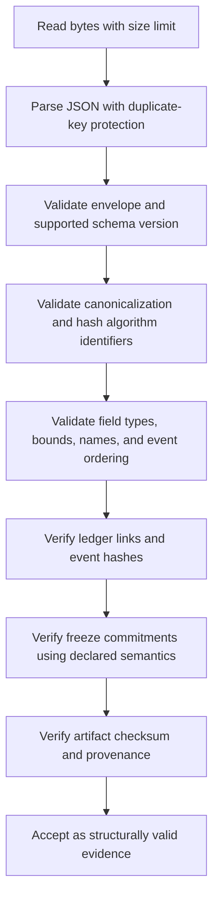

# QSO-FABRIC Output Contracts

This document records the JSON and hashing behavior currently implemented by `qso_runtime.four_qso_experiment`. It is a design and migration reference, not a declaration that the present format is a stable public contract.

`taskchain.md` P1 and `release.md` require explicit versions and canonicalization rules before the first runtime release. Until that work is accepted, consumers should treat current reports as **unversioned candidate artifacts** and reject them for durable interchange unless their exact producing commit and environment are known.

## Top-level report

The current report contains:

| Field | Current type | Meaning |
|---|---|---|
| `objective` | string | Research objective supplied to all four QSOs |
| `base_seed` | integer | Seed from which per-QSO seeds are derived |
| `limits` | object | Serialized `ExperimentLimits` |
| `ledger_valid` | boolean | Result of verifying the in-memory event chain |
| `event_count` | integer | Number of events in the report |
| `final_event_hash` | string | Hash of the final event |
| `qsos` | object | Map of QSO name to serialized QSO result |
| `events` | array | Ordered serialized event ledger |

The report currently has no `schema_version`, `canonicalization_version`, producer version, source commit, generation time, environment, or artifact checksum field. These omissions are release blockers, not permission for consumers to infer defaults.

## Limits object

Current fields:

```json
{
  "max_rounds": 4,
  "max_messages_per_qso": 8,
  "max_message_chars": 600,
  "max_runtime_seconds": 10.0
}
```

The runtime rejects non-positive round, message, or runtime values. It currently does not apply a separate validation rule to `max_message_chars`; the release contract should state the accepted range and behavior for zero, negative, extremely large, non-integer, NaN, and infinite values where applicable.

## QSO result

Each entry in `qsos` currently contains:

| Field | Current type | Meaning |
|---|---|---|
| `name` | string | Stable QSO identifier |
| `role` | string | Human-readable role description |
| `seed` | integer | Per-QSO deterministic seed |
| `observations` | array of strings | Objective intake observations |
| `inferences` | array of strings | Deterministically selected round statements |
| `contradictions` | array of strings | Reserved contradiction records; currently empty in the baseline path |
| `messages_sent` | array of objects | `{to, text}` records |
| `messages_received` | array of objects | `{from, text}` records |
| `freeze_points` | array of strings | `label:digest` markers |
| `final_proposal` | string | Final role-specific proposal |

The four current identifiers are `atlas`, `nova`, `orion`, and `lyra`. Their insertion order affects seed assignment, round order, messaging, ledger order, and hashes. A release contract must either preserve that order explicitly or encode ordering independently.

## Event record

Each event currently contains:

```json
{
  "seq": 0,
  "kind": "experiment_started",
  "actor": "fabric",
  "payload": {},
  "previous_hash": "GENESIS",
  "event_hash": "<sha256>"
}
```

Current event kinds include:

- `experiment_started`;
- `observation`;
- `freeze`;
- `inference`;
- `message_sent`;
- `message_received`;
- `runtime_limit` when triggered;
- `proposal`;
- `experiment_completed`.

The set is not yet versioned or declared exhaustive. Consumers must not silently accept unknown event kinds before an extensibility policy is defined.

## Event hashing

The current event digest is SHA-256 over UTF-8 encoded JSON for:

```json
{
  "seq": 0,
  "kind": "...",
  "actor": "...",
  "payload": {},
  "previous_hash": "..."
}
```

Serialization currently uses Python `json.dumps` with:

```python
sort_keys=True
separators=(",", ":")
```

The first event uses `GENESIS` as `previous_hash`; every later event uses the immediately preceding `event_hash`.

### Unspecified details that must be resolved

Before release, the contract must define:

- schema and canonicalization version identifiers;
- Unicode normalization and escaping;
- number representation, including floats and prohibited non-finite values;
- object-key and array ordering;
- duplicate-key handling on parse;
- allowed payload value types and nesting limits;
- digest algorithm identifiers and encoding;
- case and length requirements for hexadecimal hashes;
- behavior for unknown fields and versions;
- maximum event, payload, report, and ledger sizes;
- whether the final artifact itself is checksummed separately.

## Freeze-point hashing

A freeze digest is currently SHA-256 over the canonical JSON serialization of the QSO result using the same sorted-key and compact-separator settings.

Important current semantic:

1. the digest is calculated from the QSO result as it exists before the new freeze marker is appended;
2. the marker `label:digest` is appended to `freeze_points`;
3. a `freeze` event records `{label, state_hash}`.

This order is significant. Recomputing a freeze digest from the final result without reconstructing the state at that point will not necessarily yield the stored digest.

A stable contract should decide whether freeze points remain incremental state commitments, become explicit immutable snapshot objects, or include a declared field-exclusion rule. Any change requires a versioned migration rather than silent reinterpretation.

## Determinism contract

Current deterministic behavior depends on:

- one base seed;
- per-QSO seeds assigned by stable QSO insertion order;
- Python's local `random.Random` behavior;
- fixed role template arrays;
- fixed directed-ring message order;
- fixed round order;
- canonical JSON settings;
- absence of timestamps or external data in report state.

Exact cross-version reproducibility of Python pseudorandom behavior and serialization must be demonstrated for the supported environment matrix. If exact byte-identical replay cannot be guaranteed across all supported versions, the release must narrow the supported matrix or define a versioned deterministic algorithm independent of runtime implementation details.

## Candidate schema direction

A future versioned report could include a top-level envelope such as:

```json
{
  "contract": {
    "name": "qso-fabric-report",
    "schema_version": "1.0.0",
    "canonicalization_version": "qso-json-c14n-1",
    "hash_algorithm": "sha256"
  },
  "producer": {
    "package_version": "0.1.0-alpha.1",
    "source_commit": "<immutable commit>",
    "python_version": "<version>"
  },
  "experiment": {},
  "qsos": {},
  "events": [],
  "integrity": {
    "ledger_valid": true,
    "final_event_hash": "<sha256>",
    "artifact_hash": "<sha256>"
  }
}
```

This example is not approved implementation scope. It illustrates the metadata categories required for reliable interchange and provenance; P1 should select the smallest contract that satisfies the release gates.

## Validation order

A future consumer should validate in this order:



Structural validity does not establish the truth or quality of a final proposal. It establishes only that an artifact satisfies a declared format and integrity procedure.

## Required fixtures

At minimum, the versioned contract suite should include:

- one canonical positive report;
- repeated same-seed outputs with identical expected hashes;
- different-seed outputs with intentionally different hashes;
- malformed JSON and duplicate keys;
- missing, unknown, and incompatible versions;
- changed, deleted, inserted, duplicated, and reordered events;
- broken previous-hash links and event hashes;
- changed freeze labels, state hashes, and snapshot semantics;
- Unicode, escaping, numeric, and boundary-size cases;
- timeout, interruption, truncation, and partial-write artifacts;
- unknown QSO and event identifiers;
- upstream manifest hash/version mismatch cases.

Every fixture should identify the expected result and reason: `PASS`, `FAIL`, or `UNKNOWN` where the evidence genuinely cannot resolve acceptance.

## Compatibility policy

Until a versioned policy is adopted:

- producer changes to report fields, event kinds, hashing, ordering, seeds, templates, or freeze behavior should be treated as breaking;
- consumers should pin the source commit and expected hashes;
- unknown fields or versions should fail closed;
- upstream compatibility should remain read-only and hash/version checked;
- no report should authorize code execution, payments, credential use, network access, or repository mutation.

## Related documentation

- [Architecture](ARCHITECTURE.md)
- [Developer guide](DEVELOPER_GUIDE.md)
- [Release plan](../release.md)
- [Task chain](../taskchain.md)
