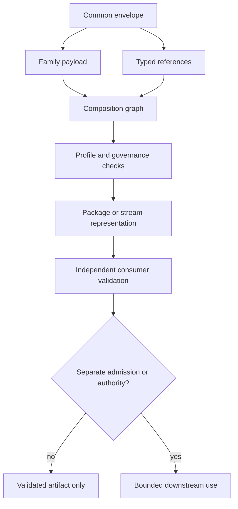

# Quantum State Object File Formats

This directory contains the **QSO format subsystem candidate** implemented on QSO-FABRIC PR #19. It provides schemas, registries, profiles, canonicalization and packaging specifications, reference tools, examples, conversions, and conformance tests.

The subsystem is a development and interoperability candidate. It is not yet an accepted portfolio standard, canonical runtime, authority service, or production SDK.

## What this subsystem owns locally

The branch currently implements local development surfaces for:

- a common QSO envelope and QSO-CORE composition references;
- family schemas for identity, manifests, genomes, self/state/memory/cognition, objectives, mutation, ethics, governance, capabilities, workflows, results, scientific models, signatures, provenance, evidence, patches, snapshots, deltas, reports, packages, and protocols;
- registries for formats, media types, extensions, algorithms, mutation classes, and conversions;
- implementation profiles, examples, and hostile package fixtures;
- reference validation, hashing, packing, unpacking, migration, registry inspection, and report-conversion tools; and
- local tests for envelope structure, profiles, registries, conversion, package safety, and hostile inputs.

It does **not** own neutral portfolio contract stewardship, operational admission, credentials, capabilities, signing keys, canonical disposition, publication approval, or cross-repository authority merely because it implements candidate representations.

## Architecture at a glance



**Diagram alternative:** every object begins with a common envelope and a family-specific payload. Typed references create a composition graph. A selected profile and governance rules constrain that graph. It may then be represented as a package or stream and independently validated. Validation alone leaves the result as an artifact; any runtime admission or authority requires a separate decision.

See [`docs/ARCHITECTURE.md`](docs/ARCHITECTURE.md) for the complete layer and trust-boundary model.

## Layout

| Path | Purpose |
|---|---|
| `spec/` | Candidate format, canonicalization, packaging, streaming, versioning, lifecycle, and interoperability specifications |
| `registry/` | Machine-readable format, media-type, extension, algorithm, and mutation registries |
| `schemas/` | Common and family-specific JSON Schemas |
| `profiles/` | Bounded implementation profiles |
| `examples/` | Reference authoring objects and mutation examples |
| `conversions/` | Source-preserving compatibility conversions and lineage records |
| `tools/` | Reference validation, hashing, packing, unpacking, migration, conversion, and registry utilities |
| `tests/` | Positive, negative, hostile-input, package, conversion, and profile tests |
| `docs/` | Architecture, governance, security, conversion, implementation, and roadmap guidance |

## Recommended reading order

1. [`spec/QSO-FORMAT-STANDARD.md`](spec/QSO-FORMAT-STANDARD.md)
2. [`docs/ARCHITECTURE.md`](docs/ARCHITECTURE.md)
3. [`docs/GOVERNANCE.md`](docs/GOVERNANCE.md)
4. [`docs/SECURITY.md`](docs/SECURITY.md)
5. [`docs/IMPLEMENTATION-GUIDE.md`](docs/IMPLEMENTATION-GUIDE.md)
6. [`docs/CONVERSION-BOUNDARY.md`](docs/CONVERSION-BOUNDARY.md)
7. [`spec/CANONICALIZATION.md`](spec/CANONICALIZATION.md)
8. [`spec/PACKAGING.md`](spec/PACKAGING.md)
9. [`spec/MUTATION-AND-LIFECYCLE.md`](spec/MUTATION-AND-LIFECYCLE.md)
10. [`docs/ROADMAP.md`](docs/ROADMAP.md)

## Local validation

From this directory:

```bash
python -m pytest -q
```

Useful reference-tool examples include:

```bash
python tools/qso_validate.py examples/minimal/minimal.qso.json
python tools/qso_hash.py examples/minimal/minimal.qso.json
python tools/qso_registry.py registry/formats.json
```

Review tool help before running pack, unpack, migration, or conversion operations:

```bash
python tools/qso_pack.py --help
python tools/qso_unpack.py --help
python tools/qso_migrate.py --help
python tools/convert_four_qso_report.py --help
```

## Current validator boundary

`tools/qso_validate.py` is a fail-closed, dependency-free validator for the current JSON authoring profile. It validates required metadata types and formats, QSO-CORE reference structure, non-placeholder SHA-256 digests, and the top-level canonical JSON content hash. It deliberately rejects BLAKE3 roots until a reviewed dependency or implementation is available.

The validator does not resolve every external reference, validate detached signatures, authenticate a signer, issue capabilities, authorize mutations, or establish that referenced manifest and identity objects exist.

## Packaging boundary

The package tools preflight archive members before extraction, reject unsafe names and member types, enforce size limits, verify the manifest, and extract manually only after validation. These protections reduce archive-processing risk but do not prove the semantic safety, authenticity, or runtime suitability of packaged resources.

## Conversion boundary

The four-QSO report converter preserves source bytes and creates separate report and provenance objects. It is deterministic only for the complete tuple of source bytes, source-path string, explicit conversion timestamp, converter implementation, and serialization rules.

Read [`docs/CONVERSION-BOUNDARY.md`](docs/CONVERSION-BOUNDARY.md) before interpreting converted objects or the conversion registry.

## Cross-repository status

QSO-FABRIC PR #15 is the owning documentation and format-governance candidate. PR #19 is an interacting implementation lineage. The two must be reconciled across project scope, format ownership, canonicalization, mutation semantics, onboarding, release gates, and rollback evidence before either becomes accepted repository direction.

## Non-authority statement

```text
valid schema
!= trusted identity
!= verified provenance
!= accepted contract
!= runtime admission
!= mutation authority
!= capability or canonical disposition
!= release, publication, or deployment approval
```

Use the subsystem as a bounded development and conformance surface until neutral ownership, cross-language compatibility, signatures, key custody, correction, revocation, recovery, and repository-local acceptance are resolved.