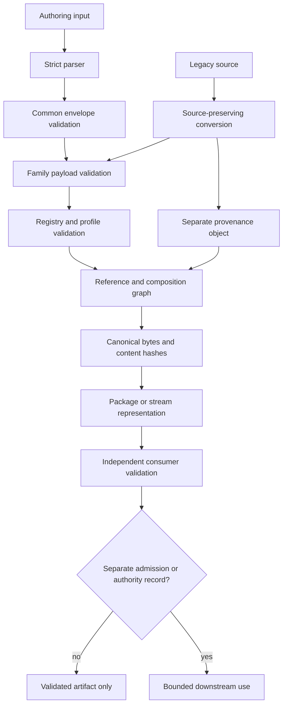

# QSO Format Subsystem Architecture

## Scope

The QSO format subsystem is a candidate representation and conformance layer inside QSO-FABRIC PR #19. It organizes typed objects, references, profiles, packages, streams, and compatibility conversions. It is not the portfolio's accepted neutral contract authority or canonical runtime.

## Layer model

**Diagram alternative:** authoring input passes through a strict parser, common-envelope validation, family-schema validation, registry and profile checks, reference-graph construction, and canonical hashing. It may then be packaged or streamed and independently validated. A validated artifact remains non-authoritative unless a separate admission or authority record permits bounded downstream use. Legacy sources enter through a source-preserving conversion that emits both a derived family object and separate provenance.

## Architectural layers

### 1. Parsing and authoring profile

The parser boundary is responsible for valid UTF-8, duplicate-key rejection where implemented, finite numbers, bounded structure, and rejection of unsupported critical fields. Authoring JSON is a reviewable representation; it is not automatically the accepted wire or storage encoding.

### 2. Common envelope

The common envelope identifies format, version, schema, object identity, timestamps, mutation classification, encoding, source, conversion, and content hash. Shared field names do not create shared semantics unless the corresponding registry, profile, and compatibility rules are accepted.

### 3. Family payload

Each family owns its payload vocabulary and validation rules. Identity, genome, state, memory, governance, capability, provenance, evidence, report, package, and protocol payloads are not interchangeable merely because they use the same envelope.

### 4. Registries and profiles

Registries enumerate supported formats, media types, extensions, algorithms, mutation classes, and conversions. Profiles select a bounded subset and additional requirements. A registry entry records a local development capability; it does not appoint the registry owner or authorize runtime use.

### 5. Composition graph

Typed references join objects into a graph. Resolvers must verify required targets, content hashes, version compatibility, allowed cycles, and profile constraints before exposing any executable entrypoint. Missing, conflicting, or unsupported references fail closed.

### 6. Canonicalization and content addressing

The current Python tools implement a deterministic local JSON authoring profile. Portfolio acceptance still requires explicit Unicode normalization, number rules, timestamp semantics, ordering, size limits, hash domains, signature domains, cross-language vectors, and migration rules.

A content hash binds bytes under a named procedure. It does not prove truth, authority, freshness, privacy compliance, or permission to execute.

### 7. Packaging and streaming

Packages bind an explicit manifest to member paths, sizes, media types, and digests. The unpacker preflights the archive and rejects unsafe paths, members, compression, collisions, sizes, and manifest drift before extraction.

Streaming defines transport framing, not semantic acceptance. A delivered frame or valid package is not a canonical disposition.

### 8. Conversion and provenance

Compatibility converters retain the source and emit derived objects with separate identities. Conversion lineage must bind source bytes, converter version, mapping, timestamp, outputs, and rollback. See [`CONVERSION-BOUNDARY.md`](CONVERSION-BOUNDARY.md).

## Trust zones

| Zone | Examples | Trust assumption | Required boundary |
|---|---|---|---|
| Untrusted input | Authoring JSON, archives, legacy reports | Malformed, oversized, ambiguous, or adversarial | Strict parsing, limits, closed failure |
| Local conformance | Schemas, registries, tools, tests | Correct only for exact source and fixtures | Exact-head evidence and independent review |
| Derived artifacts | Converted reports and provenance | Representation may be valid while source claims are not | Source binding and separate disposition |
| Packages and streams | Archives, framed records | Transport may preserve bytes without preserving meaning | Manifest, digest, profile, and consumer checks |
| Authority-bearing systems | Admission, capability, canonical disposition, recovery | Outside this subsystem unless separately approved | Independent identity, approval, signatures, and audit |

## Repository relationships

- **QSO-FABRIC** owns the local experiment, event, freeze, and coordination semantics that are explicitly accepted for this repository.
- **QSO-GENOMES** is the candidate owner of declarative genome identity, lineage, and policy references.
- **QuantumStateObjects** is the candidate bounded runtime and execution-evidence subsystem.
- **`qsio-kernel`** is the candidate small reference-conformance implementation.
- **Repository `1`** is the candidate independent quarantine, capability, disposition, revocation, and recovery authority.
- **A neutral steward** remains required for generic envelope, canonicalization, namespace, registry, mapping, and shared fixture policy.

No repository obtains another repository's semantic or operational authority by importing its schema or passing its fixtures.

## Core invariants

1. Object identity, source identity, conversion identity, package identity, execution identity, and disposition identity remain separate.
2. Observation, interpretation, proposal, capability, execution, verification, and acceptance remain separate records.
3. Mutation description never implies mutation authorization.
4. Validation success never implies runtime admission.
5. Delivery never implies acceptance.
6. Recovery of bytes never implies restoration of authority.
7. Correction, revocation, and supersession preserve prior evidence.
8. Unknown ownership, unsupported versions, unresolved references, and ambiguous mappings fail closed.

## Current implementation limitations

The branch still requires accepted cross-language canonicalization vectors, complete schema resolution, detached signature validation, key custody, signed manifests, nested archive policy, authorized patch application, durable registry governance, correction/revocation propagation, recovery semantics, independent security review, and PR #15/#19 reconciliation.

## Non-authority statement

The architecture describes how candidate artifacts are represented and checked. It does not approve a format, select neutral stewardship, issue credentials or capabilities, authorize mutation, accept runtime state, publish a package, or permit deployment.