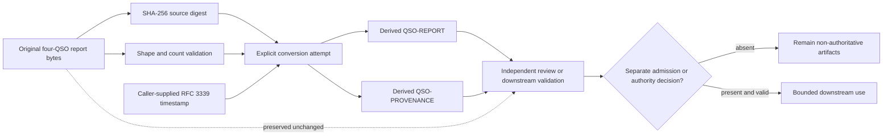

# Conversion and Provenance Boundary

## Status

This document describes the implemented development adapter that converts a bounded four-QSO experiment report into candidate `QSO-REPORT` and `QSO-PROVENANCE` objects. It documents behavior already present in PR #19; it does not approve the QSO format family, select a neutral contract owner, authorize mutation, or create a production migration path.

## Purpose

Legacy and repository-local artifacts should not be silently renamed or rewritten to appear native to a new format. The conversion path therefore preserves four distinct identities:

1. **source artifact** — the original report bytes;
2. **conversion attempt** — the tool, version, explicit timestamp, and source path used;
3. **derived report** — a structured projection of objectives, observations, inferences, contradictions, proposals, and freeze points;
4. **derived provenance** — the source event ledger, limits, seed, and source-declared ledger state.

The derived objects reference the source digest and one another. They do not replace the source or prove that the source claims are true.

## Architecture



**Diagram alternative:** the original report is read without modification, hashed, and checked for the required top-level structure. The caller supplies a conversion timestamp. The converter emits one derived report and one derived provenance object, each with its own identity and content hash and both bound to the source digest. The source remains available for independent review. Any downstream admission or authority decision occurs separately; without it, all three artifacts remain non-authoritative research evidence.

## Implemented inputs and outputs

### Required source fields

The converter currently requires:

- `objective`;
- `base_seed`;
- `limits`;
- `ledger_valid`;
- `event_count`;
- `final_event_hash`;
- `qsos` as an object; and
- `events` as an array.

It verifies that `event_count` matches the number of events. It does **not** independently recompute the entire source ledger or validate every nested value against a versioned source schema.

### Derived report

The report object carries:

- format and schema identifiers;
- a source-derived object identity;
- the explicit conversion timestamp;
- the source path and SHA-256 digest;
- the conversion identifier;
- objective summary;
- per-QSO observations, inferences, contradictions, final proposals, and freeze points; and
- references to the source and derived provenance object.

### Derived provenance

The provenance object carries:

- format and schema identifiers;
- a source-derived object identity;
- the explicit conversion timestamp;
- source path and digest;
- the source event array;
- source-declared ledger validity, count, final event hash, hash algorithm, and genesis marker; and
- experiment objective, seed, and limits.

`valid_at_source` records the source report's claim. It is not an independent attestation that the ledger was recomputed successfully.

## Determinism and identity

The converter is deterministic only for the complete input tuple:

```text
source bytes
+ normalized source-path string
+ explicit created-at value
+ converter implementation
+ serialization rules
= derived bytes and content hashes
```

Changing the timestamp or source-path string changes the derived bytes and content hashes even when source bytes are unchanged. Documentation, tests, and registries must therefore avoid claiming unconditional determinism.

The current authoring serializer uses sorted-key, compact UTF-8 JSON with non-finite numbers disabled for content hashing. This is an implemented local profile, not yet an accepted portfolio canonicalization standard.

## Trust and authority boundaries

Conversion does not establish:

- source authenticity or truth;
- complete source-schema validity;
- independent ledger verification;
- signer identity or signature validity;
- currentness, freshness, or replay safety;
- runtime admission;
- mutation, capability, financial, merge, release, or deployment authority;
- canonical portfolio state; or
- permission to delete or overwrite the source.

A conversion receipt is representation evidence, not acceptance evidence.

## Failure posture

The current tool fails when required top-level fields are missing, `qsos` or `events` have the wrong container type, or `event_count` disagrees with the event array. Downstream hardening remains required for:

- strict duplicate-key rejection when parsing source JSON;
- closed source schemas and nested type/range limits;
- maximum source and output sizes;
- source-path normalization and privacy handling;
- independent event-chain recomputation;
- trusted timestamp policy and clock uncertainty;
- atomic output writes and partial-write recovery;
- collision-resistant registry and object-identity rules;
- signature and key-custody policy;
- cross-language canonicalization vectors; and
- correction, revocation, supersession, and rollback semantics.

## Reviewer checklist

Before accepting a conversion generation, verify:

1. the exact source commit, path, bytes, and digest;
2. the exact converter commit and command;
3. the explicit timestamp and its authority;
4. source-schema and event-ledger validation results;
5. report and provenance object identities and hashes;
6. source preservation and rollback location;
7. privacy, retention, licensing, and publication treatment;
8. whether a separate admission or disposition record exists; and
9. whether all downstream consumers can process correction or revocation.

## Reconciliation requirement

PR #19's implemented conversion surface must be reconciled with PR #15's documentation and format-governance model. That reconciliation must decide whether the adapter remains local to QSO-FABRIC, moves behind a neutral conversion contract, or is retained only as a compatibility tool. Until then, the registry status `ready` means locally available for review and tests, not portfolio-approved or release-ready.