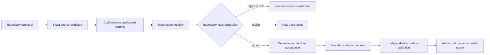

# QSO Format Governance

## Governance objective

QSO governance separates **description** from **authority**. Schemas may describe identities, capabilities, mutations, approvals, signatures, or recovery records, but possessing or validating such a file does not make the described authority effective.

The current format subsystem is a candidate implementation and conformance surface. Governance ownership remains proposed until QSO-FABRIC PR #15 and PR #19 are reconciled and portfolio decisions D1–D5 are recorded.

## Required separation

```text
proposal
!= review
!= authorization
!= execution
!= resulting-state verification
!= canonical disposition
!= correction or revocation
!= recovery
```

No single file, component, repository, interface, or workflow may silently collapse these stages.

## Candidate ownership model

| Surface | Candidate owner | Boundary |
|---|---|---|
| Generic envelope and shared identity primitives | Neutral contract steward | Must remain non-operational and independently governed |
| Canonicalization, mappings, registries, and shared fixtures | Neutral conformance steward | Reference tools do not become normative by default |
| Genome identity, lineage, and policy references | QSO-GENOMES | Declarative only; no capability issuance |
| Local runtime admission and execution evidence | QuantumStateObjects | Execution success is not canonical acceptance |
| Fabric experiments, event ledgers, freeze points, and local coordination | QSO-FABRIC | Does not own portfolio-wide authority or canonical state |
| Reference conformance evaluation | `qsio-kernel` | Comparison oracle, not broad runtime authority |
| Quarantine, capability, disposition, revocation, and recovery | Repository `1` or accepted successor | Requires explicit human and constitutional authorization |
| Review rendering | QSO-STUDIO and compatible AionUi host | Interface interaction is not approval |

Candidate ownership is not acceptance.

## Mutation governance

Mutation records must keep these dimensions independent:

- source: human, system, imported, derived, or repair;
- operation: add, replace, remove, patch, migrate, compact, restore, or supersede;
- affected scope: object, payload field, reference graph, package, runtime state, or policy;
- authority: proposal, approved capability, emergency containment, or none;
- lifecycle: temporary, persistent, append-only, reversible, or destructive;
- evidence: pre-state, operation, post-state, verifier, and rollback checkpoint;
- disposition: accepted, rejected, quarantined, corrected, revoked, superseded, or unknown.

Labels such as `self-modifying`, `derived`, or `append-only` describe behavior. They do not authorize it.

## Constitutional and protected controls

Constitutional, consent, identity-continuity, provenance, privacy, and emergency-stop controls outrank lower-authority policy. A format profile may reference those controls but may not weaken, replace, or self-amend them.

Changes to protected controls require:

1. immutable proposal and evidence identities;
2. qualified and independent review;
3. conflict and recusal handling;
4. explicit human approval where required;
5. bounded activation separate from approval;
6. consumer propagation and acknowledgment;
7. rollback and independently verified restoration; and
8. retained dissent, correction, revocation, and supersession history.

## Registry governance

Registry changes must identify:

- semantic owner;
- version and compatibility class;
- canonical source and digest;
- extension and unsupported-version behavior;
- migration and deprecation plan;
- positive, negative, stale, replay, partial, and rollback fixtures;
- privacy, licensing, and publication treatment; and
- correction, revocation, and incident owner.

A local registry entry such as `ready` or `converted` indicates local implementation state only. It does not create portfolio acceptance or production eligibility.

## Review and acceptance sequence



**Diagram alternative:** a repository proposal is bound to exact-source evidence, conformance and hostile fixtures, and independent review. The repository then records a local disposition. Rejected or held work stops while preserving evidence; revisions create a new generation. Accepted documentation still requires a separate architecture decision, bounded activation request, and independent activation validation before any authorized use.

## Emergency controls

Emergency locks may halt package admission, mutation, conversion, capability activation, or publication. Suspension is temporary and does not rewrite history. Permanent revocation, recovery, and restart require separately attributable decisions and verification.

Rejected proposals and failed operations remain append-only evidence unless a lawful retention or privacy rule requires restricted handling. Deletion is not a substitute for correction or revocation.

## Pull-request reconciliation

PR #15 and PR #19 must be reconciled without treating either branch as automatically authoritative:

- PR #15 contributes project overview, architecture, onboarding, ownership analysis, and release governance;
- PR #19 contributes implemented schemas, registries, tools, profiles, conversions, packaging, and tests;
- the resulting repository direction must preserve provenance from both;
- contradictions in format ownership, canonical JSON/CBOR status, mutation semantics, signing, and recovery must be explicitly resolved; and
- all checks must be rerun at the resulting immutable head.

## Non-authority statement

Passing tests, schema validation, a successful conversion, a valid package, or a merged documentation change does not appoint a steward, accept a contract, issue a capability, approve mutation, authorize release, or create canonical state.